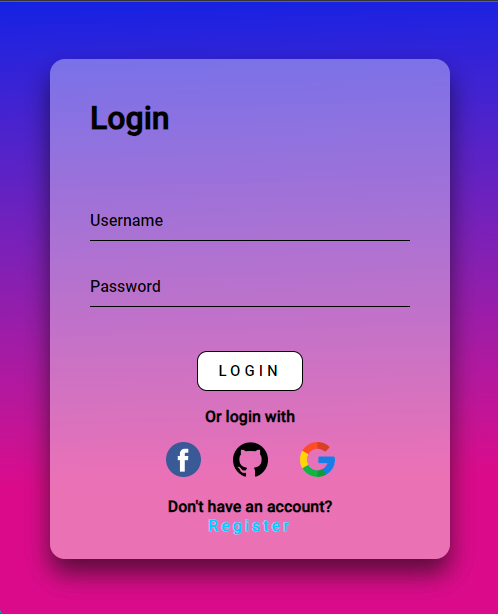

<h1 align="center"> Animated Login </h1>

  <a href="#-tecnologias">Tecnologias</a>&nbsp;&nbsp;&nbsp;|&nbsp;&nbsp;&nbsp;
  <a href="#-projeto">Projeto</a>&nbsp;&nbsp;&nbsp;|&nbsp;&nbsp;&nbsp;
  <a href="#-layout">Layout</a>&nbsp;&nbsp;&nbsp;|&nbsp;&nbsp;&nbsp;
  <a href="#memo-licença">Licença</a>

  

 

  

## 🚀 Tecnologias

Esse projeto foi desenvolvido com as seguintes tecnologias:

- HTML e CSS
- Git e Github
- Figma

## 💻 Projeto

- Esse é um projeto simples que pratico alguns conhecimentos de HTML e CSS, com o objetivo de criar um formulário de login animado.

## 🔖 Layout

Você pode visualizar o layout do projeto<a href="https://www.figma.com/file/A7yMlfMiXUWx5iKaw3NNcL/Login-Screen?type=design&t=pbGHkHI4uy4UjI6Z-6" target="_blank"> Neste Link</a>.

É necessário ter conta no <a href="https://figma.com" target="_blank">Figma</a> para acessá-lo.

## Licença

Esse projeto está sob a licença MIT.

---

Feito com ♥ by LucelhoSilva [Entre em contato!](https://www.linkedin.com/in/lucelhosilva/)
