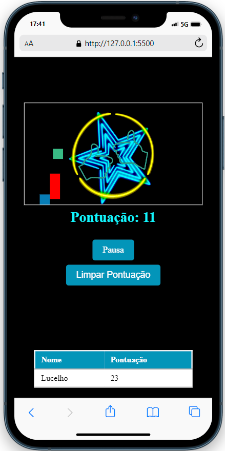

<h1 align="center"> Jump Game </h1>

  <a href="#descrição-do-projeto">Descrição do Projeto</a>&nbsp;&nbsp;&nbsp;|&nbsp;&nbsp;&nbsp;
  <a href="#funcionalidades">Funcionalidades</a>&nbsp;&nbsp;&nbsp;|&nbsp;&nbsp;&nbsp;
  <a href="#tecnologias-utilizadas">Tecnologias Utilizadas</a>&nbsp;&nbsp;&nbsp;|&nbsp;&nbsp;&nbsp;
  <a href="#licença">Licença</a>&nbsp;&nbsp;&nbsp;|&nbsp;&nbsp;&nbsp;
  <a href="#autor">Autor</a>

  

## Descrição do Projeto

Este é um jogo de plataforma simples onde o objetivo é pular sobre os obstáculos que se movem pela tela. O jogo possui um design minimalista e é controlado usando as teclas de seta esquerda e direita para mover o personagem.

## Funcionalidades

- **Controles Simples:** Use as setas esquerda e direita para mover o personagem.
- **Pular:** Pressione qualquer tecla para fazer o personagem pular.
- **Pausa/Continuar:** Pausa e continua o jogo a qualquer momento.
- **Pontuação:** Quanto mais tempo voce resistir mais pontos faz.
- **Registra Nome:** Antes de iniciar, é possível inserir um nome de jogador.
- **Tabela de Pontuações:** Exibe as pontuações mais recentes dos jogadores.
- **Limpar Pontuações:** Limpa a tabela de pontuações.
- **Responsividade:** Design Adaptável para diferentes tamanhos de tela como tablet, computadores e celulares ,testes feitos em dispositivos como iphone10 e galaxy s21 ultra mas tambem compativel com outros.

## Tecnologias Utilizadas

- _Linguagens:_ HTML - CSS - JavaScript
- _Controle de Versão:_ Git
- _IDE:_ Visual Studio Code
- _Hospedagem do Código:_ GitHub

## Licença

Este projeto está sob a . Consulte o arquivo [LICENSE](./LICENSE) para obter mais detalhes.

## Autor

Feito com ❤️ por Lucelho Silva. [Entre em contato !](https://www.linkedin.com/in/lucelho-silva-b17196239/)
