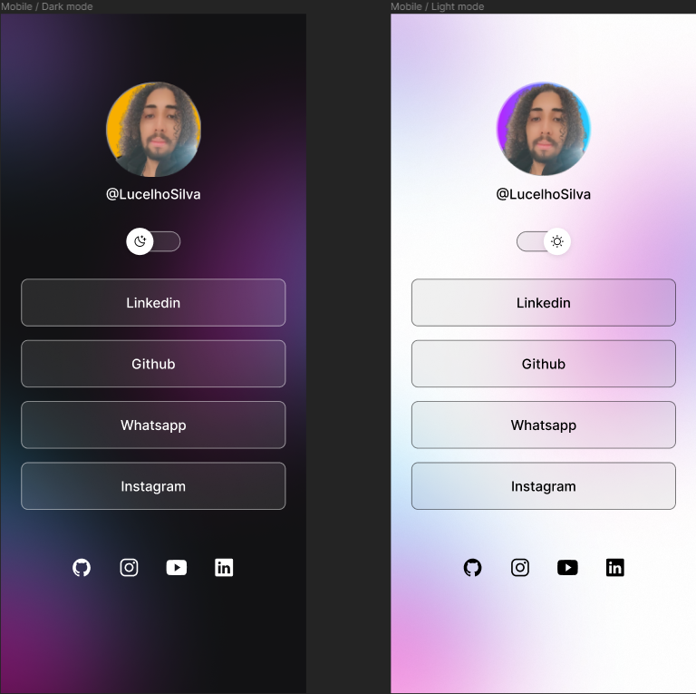

<h1 align="center"> Link_Three </h1>

Projeto exclusivo e gratuito, promovido pela Rocketseat para ensino de tecnologias WEB.  

  <a href="#-tecnologias">Tecnologias</a>&nbsp;&nbsp;&nbsp;|&nbsp;&nbsp;&nbsp;
  <a href="#-projeto">Projeto</a>&nbsp;&nbsp;&nbsp;|&nbsp;&nbsp;&nbsp;
  <a href="#-licença">Licença</a>

  

 

  

## 🚀 Tecnologias

| Linguagens | Controle de Versão | Design e Prototipagem | IDE                |
| ---------- | ------------------ | --------------------- | ------------------ |
| HTML       | Git                | figma                 | Visual Studio Code |
| CSS        | GitHub             |                       |                    |
| JavaScript |                    |                       |                    |

## 💻 Projeto

O LinkThree é um agregador de links para usar como cartão de visitas online.

## Licença

Esse projeto está sob a licença MIT.

---

Projeto exclusivo e gratuito, promovido pela ♥ by Rocketseat [Participe da nossa comunidade!](https://discord.gg/rocketseat)
