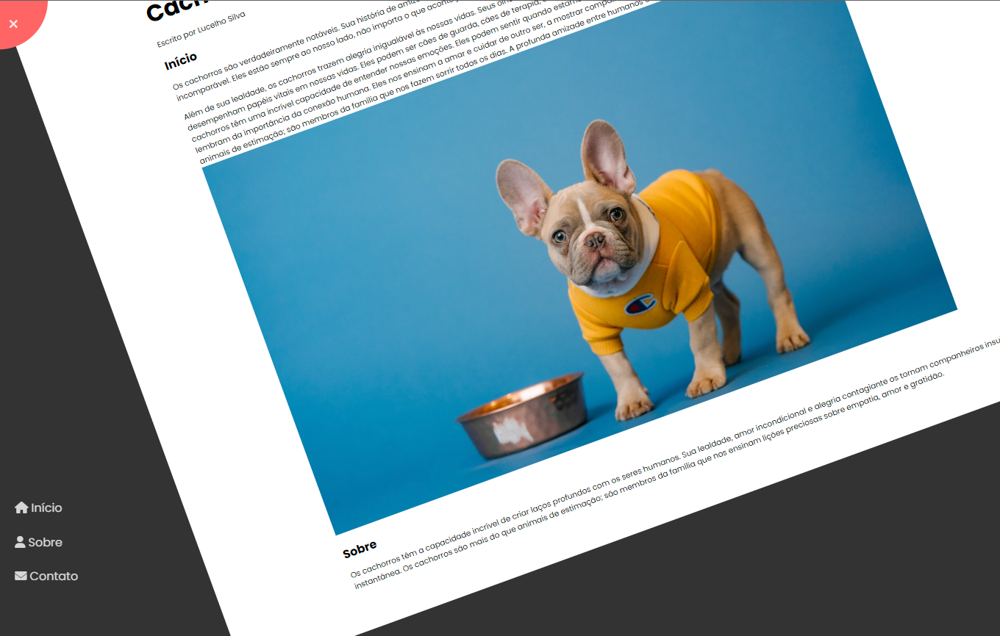

# Rotating Menu

<p align="center">
  
</p>


<p align="center">
  
</p>

## Sumário

- [Tecnologias Utilizadas](#tecnologias-utilizadas)
- [Descrição do Projeto](#descrição-do-projeto)
- [Como Utilizar](#como-utilizar)
- [Licença](#licença)
- [Autor](#autor)

## Tecnologias Utilizadas

- **Linguagens:** HTML, CSS, JavaScript
- **Controle de Versão:**
- **Design e Prototipagem:**
- **IDE:** Visual Studio Code
- **Hospedagem do Código:** GitHub

## Descrição do Projeto

O projeto "Rotating Menu" é um site estático que oferece um artigo informativo e inspirador sobre a profunda conexão entre os seres humanos e seus fiéis amigos de quatro patas, os cachorros. Este projeto é uma demonstração prática de desenvolvimento web, onde são aplicados conhecimentos em HTML, CSS e JavaScript para criar uma experiência envolvente para os leitores.O destaque do projeto é o menu rotativo localizado no canto superior esquerdo da página. Esse menu é circular e gira quando ativado, criando uma animação de rotação única.

## Como Utilizar

Para utilizar o projeto localmente, siga estas etapas:

1. Faça o Fork do Repositório:

   ```bash
   clique no botão "Fork" no canto superior direito da página
   ```

2. Clone o repositório:

   ```bash
   git clone https://github.com/seu-usuario/rotating-menu.git
   cd rotating-menu
   ```
